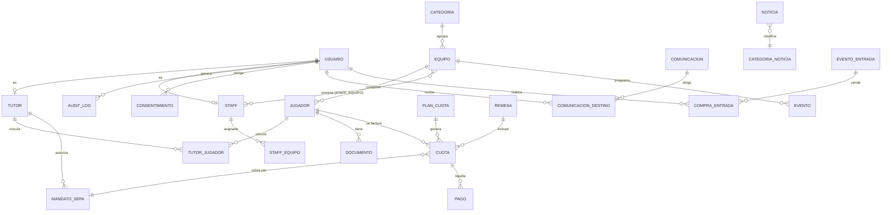

# 02 · Modelo de datos (Entregable 4)

> Autor: Arquitecto Full Stack + DBA. Incluye diagrama ER, tablas, relaciones, índices y restricciones.
> Implementación canónica: [`prisma/schema.prisma`](../prisma/schema.prisma). SQL de referencia: [`db/schema.sql`](../db/schema.sql).

## 1. Diagrama ER (Mermaid)

## 2. Decisiones de modelado

- **`usuario` separado de `tutor`/`staff`**: las credenciales y el rol viven en `usuario`; los datos de perfil en tablas especializadas. Un usuario es 1:1 con tutor **o** staff. Esto permite que un mismo login sirva para intranet y admin según su rol.
- **`tutor` ↔ `jugador` es N:N** mediante `tutor_jugador`, no 1:N. El brief dice "1 padre → N jugadores", pero en la práctica **un jugador suele tener 2 progenitores/tutores** y un tutor varios hijos. La tabla puente cubre ambos casos sin perder el requisito (incluye `parentesco` y flag `es_contacto_principal`).
- **Cuotas vs Pagos**: `cuota` = lo que se debe (deuda devengada); `pago` = intento/liquidación real (con su `provider_payment_id`). Separarlos permite reintentos, impagos y conciliación.
- **`plan_cuota`**: define la cuota recurrente mensual de una categoría/equipo (importe, periodicidad). Las `cuota` se generan a partir del plan.
- **`mandato_sepa`**: el IBAN cifrado nunca se guarda completo en claro; se almacena el `mandate_id` de GoCardless + últimos 4 dígitos + estado. El IBAN en sí lo custodia el proveedor (reduce alcance PCI/RGPD).
- **`remesa`**: agrupación de cuotas para cobro en lote (modelo SEPA español: el club "pasa la remesa" mensual).
- **`audit_log` y `consentimiento`**: obligatorios para RGPD (trazabilidad y prueba de consentimiento).

## 3. Enumerados

| Enum | Valores |
|------|---------|
| `Rol` | `SUPER_ADMIN`, `ADMIN`, `COORDINADOR`, `ENTRENADOR`, `FAMILIA` |
| `EstadoCuota` | `PENDIENTE`, `EN_REMESA`, `PAGADA`, `IMPAGADA`, `DEVUELTA`, `CONDONADA` |
| `EstadoPago` | `INICIADO`, `CONFIRMADO`, `FALLIDO`, `REEMBOLSADO` |
| `EstadoMandato` | `PENDIENTE`, `ACTIVO`, `CANCELADO`, `EXPIRADO` |
| `MetodoPago` | `SEPA_GOCARDLESS`, `TARJETA_STRIPE`, `TRANSFERENCIA`, `EFECTIVO` |
| `TipoDocumento` | `FICHA_FEDERATIVA`, `AUTORIZACION`, `PROTECCION_DATOS`, `CERTIFICADO_MEDICO`, `OTRO` |
| `TipoEvento` | `ENTRENAMIENTO`, `PARTIDO`, `EVENTO` |
| `Parentesco` | `PADRE`, `MADRE`, `TUTOR_LEGAL`, `OTRO` |

## 4. Índices y restricciones clave

- `usuario.email` UNIQUE, `usuario.dni` UNIQUE (ambos opcionales pero únicos cuando existen).
- `jugador (apellidos, nombre)` índice de búsqueda; `jugador.equipo_id` FK indexada.
- `cuota (jugador_id, periodo)` UNIQUE → no duplicar la cuota de un mes.
- `cuota.estado` indexada (consultas de impagos).
- `pago.provider_payment_id` UNIQUE → idempotencia de webhooks.
- `audit_log (usuario_id, created_at)` índice; particionable por fecha a futuro.
- FKs con `ON DELETE RESTRICT` en datos financieros; `CASCADE` solo en puentes y documentos.
- CHECK: `cuota.importe_centimos >= 0`, `mandato_sepa.iban_last4` longitud 4.

## 5. Retención y minimización (RGPD)

- IBAN completo **no** se persiste (lo guarda el proveedor de pago).
- Certificados médicos: acceso restringido a `ADMIN`/`COORDINADOR`/entrenador del equipo; URL firmada y temporal.
- Borrado/anonimización de jugador y tutor tras baja + periodo legal de conservación contable (6 años para documentos contables en España).
