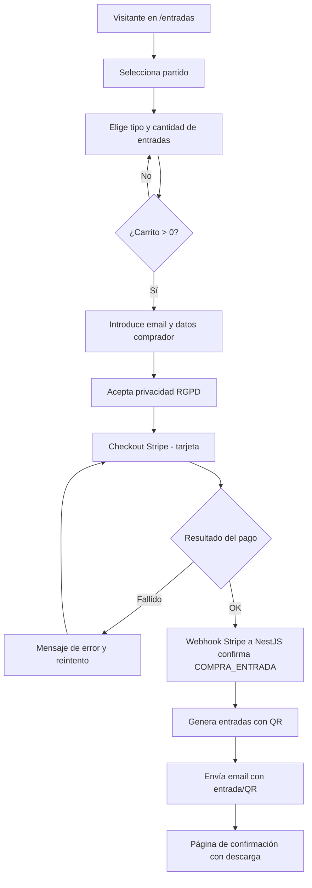
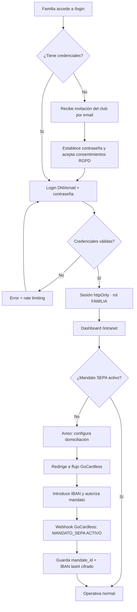
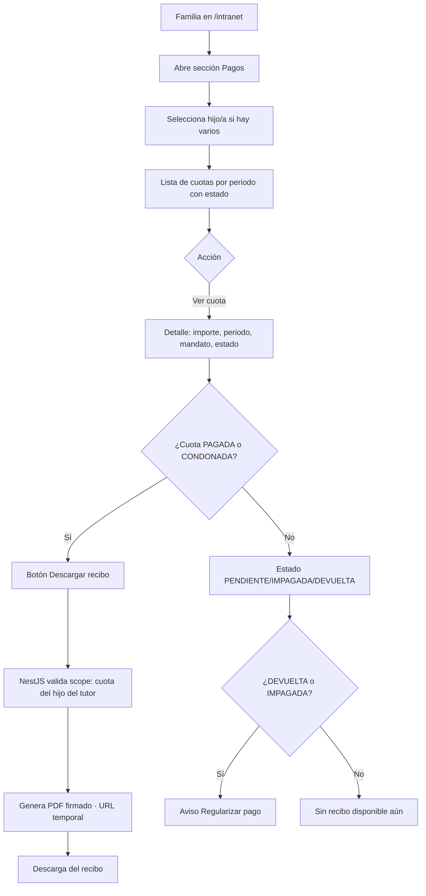
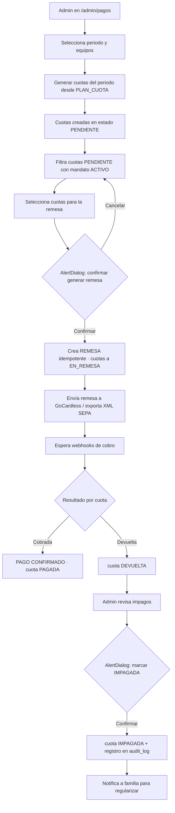
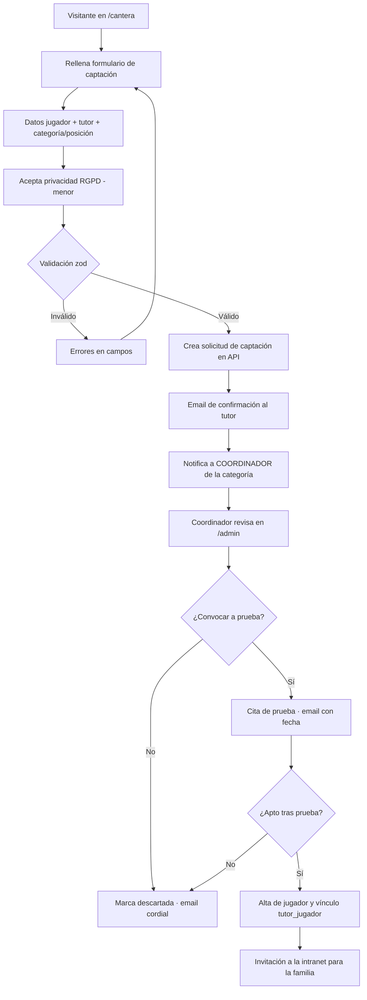

# 03 · Diseño UX/UI + Wireframes + Flujo de usuarios (Entregables 5 y 6)

> Autor: Diseñador UX/UI senior (clubes deportivos) · Revisado por PM, Arquitectura y Pagos.
> Stack de implementación: Next.js 15 (App Router), React 19, TailwindCSS, shadcn/ui.
> Referencia de inspiración estructural (no copiar): clubes de fútbol modernos tipo `adalcorcon.com`.
> Coherente con rutas de [`01-arquitectura.md`](./01-arquitectura.md) y enums de [`02-modelo-datos.md`](./02-modelo-datos.md).

---

## 1. Principios de diseño

1. **Mobile-first.** El 70-80% del tráfico de un club llega desde el móvil (familias consultando partidos, pagos, comunicaciones). Se diseña primero a 360 px y se escala hacia arriba. Breakpoints Tailwind: `sm 640`, `md 768`, `lg 1024`, `xl 1280`, `2xl 1536`.
2. **Rápido.** Web pública en SSG/ISR cacheable en CDN; imágenes con `next/image` (AVIF/WebP, `priority` solo en el hero); fuentes con `next/font` (sin FOUT). Objetivo Core Web Vitals "Good": LCP < 2,5 s, INP < 200 ms, CLS < 0,1.
3. **Accesible (WCAG 2.1 AA).** Contraste mínimo 4,5:1 (texto) y 3:1 (UI/iconos), foco visible siempre, navegación completa por teclado, objetivos táctiles ≥ 44×44 px, todo formulario con `label` asociada y `aria-describedby` para errores.
4. **Moderno y sobrio.** Estética deportiva con identidad fuerte (rojo de marca), mucho espacio en blanco, jerarquía tipográfica clara, microinteracciones discretas. La marca manda; la decoración, no.
5. **Claridad por encima de densidad.** En zonas de datos sensibles (pagos, documentos) prima la legibilidad y la confianza sobre meter información. Estados de carga, vacío y error explícitos en cada vista.
6. **Consistencia.** Un único design system (`packages/ui`) basado en tokens; nada de estilos sueltos. Los mismos componentes en web pública, intranet y admin.

---

## 2. Sistema de diseño / Tokens

Identidad cromática del **Club Atlético Antoniano**: **rojo carmín** como primario (energía, pertenencia) sobre **blanco** dominante, con **antracita** para texto y estructura. Acentos semánticos para estados de pago. Se entrega en **modo claro** (único objetivo de este entregable; el modo oscuro queda fuera de alcance pero los tokens ya están preparados como variables CSS para añadirlo sin refactor).

### 2.1 Color

| Token | Hex | Uso | Contraste sobre |
|-------|-----|-----|-----------------|
| `--brand-primary` | `#C8102E` | Color de marca, botones primarios, enlaces activos, barras | blanco: 4,6:1 (AA texto) |
| `--brand-primary-hover` | `#A60D26` | Hover/pressed del primario | blanco: 6,1:1 |
| `--brand-secondary` | `#1A2330` | Antracita: navbar, footer, titulares | blanco: 14,8:1 (AAA) |
| `--brand-accent` | `#F2A900` | Detalles, badges "destacado", CTA cantera | sobre antracita 8,3:1 |
| `--bg-base` | `#FFFFFF` | Fondo de página | — |
| `--bg-subtle` | `#F6F7F9` | Secciones alternas, cards | — |
| `--bg-muted` | `#ECEEF2` | Inputs, separadores suaves | — |
| `--fg-default` | `#1A2330` | Texto principal | bg-base 14,8:1 |
| `--fg-muted` | `#5B6573` | Texto secundario, metadatos | bg-base 5,2:1 (AA) |
| `--border` | `#E2E5EA` | Bordes de card, tabla, inputs | — |
| `--ring` | `#C8102E` | Anillo de foco (`focus-visible`) | — |
| `--success` | `#1E7F4F` | Cuota PAGADA, mandato ACTIVO | blanco 4,8:1 |
| `--warning` | `#B26A00` | Cuota PENDIENTE / EN_REMESA | blanco 4,6:1 |
| `--danger` | `#C0341D` | Cuota IMPAGADA / DEVUELTA, errores | blanco 4,9:1 |
| `--info` | `#1B5FA8` | Avisos informativos | blanco 5,3:1 |

> Mapeo a estados de `EstadoCuota`: `PENDIENTE`/`EN_REMESA` → `warning`; `PAGADA`/`CONDONADA` → `success`; `IMPAGADA`/`DEVUELTA` → `danger`. Nunca se comunica el estado **solo** con color: siempre acompaña texto y/o icono (requisito WCAG 1.4.1).

### 2.2 Tipografía

| Token | Valor | Uso |
|-------|-------|-----|
| `--font-display` | "Archivo" / "Anton" condensada | Titulares H1-H2, marcadores, números de dorsal |
| `--font-sans` | "Inter" (vía `next/font`) | Texto, UI, formularios |
| `--font-mono` | "Geist Mono" | Importes, IBAN ofuscado, referencias de pago |

Escala (mobile → desktop, `clamp`):

| Token | Tamaño | Line-height | Peso |
|-------|--------|-------------|------|
| `text-display` | 40 → 64 px | 1.05 | 800 |
| `text-h1` | 30 → 44 px | 1.1 | 700 |
| `text-h2` | 24 → 32 px | 1.2 | 700 |
| `text-h3` | 20 → 24 px | 1.3 | 600 |
| `text-body` | 16 px | 1.6 | 400 |
| `text-sm` | 14 px | 1.5 | 400 |
| `text-xs` | 12 px | 1.4 | 500 |

> Base 16 px nunca por debajo en cuerpo de texto. Uso de unidades `rem` para respetar el zoom del navegador (WCAG 1.4.4).

### 2.3 Espaciado, radios, sombras, capas

| Categoría | Token | Valor |
|-----------|-------|-------|
| Espaciado (escala 4 px) | `space-1 … space-16` | 4, 8, 12, 16, 24, 32, 48, 64 px |
| Radio | `radius-sm` / `md` / `lg` / `xl` / `full` | 4 / 8 / 12 / 16 / 9999 px |
| Sombra | `shadow-sm` | `0 1px 2px rgba(16,24,40,.06)` |
| Sombra | `shadow-md` | `0 4px 12px rgba(16,24,40,.08)` |
| Sombra | `shadow-lg` | `0 12px 32px rgba(16,24,40,.12)` |
| Contenedor | `container-max` | 1200 px, padding lateral 16 (móvil) / 24 (desktop) |
| Z-index | `z-nav` / `z-overlay` / `z-modal` / `z-toast` | 50 / 60 / 70 / 80 |
| Foco | `focus-visible` | `outline: 2px solid var(--ring); outline-offset: 2px` |

Implementación: tokens como CSS variables en `:root` dentro de `packages/ui/styles`, expuestos a Tailwind vía `theme.extend` y consumidos por las variables de shadcn/ui (`--background`, `--foreground`, `--primary`, etc.).

---

## 3. Componentes clave (sobre shadcn/ui)

| Componente | Base shadcn/ui | Notas de diseño |
|------------|----------------|-----------------|
| **Navbar** | `NavigationMenu` + `Sheet` (móvil) | Sticky, fondo antracita. Logo izq., menú centro (Inicio, Noticias, Primer equipo, Cantera, Club, Entradas), CTA "Intranet" der. En móvil colapsa a hamburguesa → `Sheet` lateral. Indicador de ruta activa con barra inferior roja. |
| **Hero** | composición propia | Imagen a sangre con overlay degradado antracita→transparente, titular `display`, subtítulo, 2 CTA (primario "Hazte socio" / secundario "Comprar entradas"). LCP optimizado. |
| **Card de noticia** | `Card` + `Badge` | Imagen 16:9 (`next/image`), badge de categoría (`CategoriaNoticia`), título 2 líneas máx., fecha + tiempo de lectura, enlace a toda la card. Variante "destacada" más grande para portada. |
| **Card de partido — próximo** | `Card` | Competición + jornada, escudos de ambos equipos, fecha/hora, estadio, botón "Entradas" o "Añadir al calendario". |
| **Card de partido — resultado** | `Card` | Igual layout con marcador en `display`, etiqueta V/E/D con color semántico (no solo color). |
| **Tabla de plantilla** | `Table` + `Avatar` | Foto, dorsal (`display`), nombre, posición, filtro por línea (portero/defensa/medio/delantero). En móvil colapsa a grid de cards. Cabeceras con `scope="col"`. |
| **Formularios** | `Form` (react-hook-form + zod) + `Input`, `Select`, `Checkbox`, `RadioGroup` | Esquemas zod compartidos con la API (`packages/shared`). Errores bajo el campo con `role="alert"`. Botón de envío con estado `loading` y deshabilitado. |
| **Dashboard widgets** | `Card`, `Tabs`, `Badge`, `Progress` | KPIs (próxima cuota, documentos pendientes, próximo evento). Estados vacío/carga (`Skeleton`) explícitos. |
| **Tabla de pagos (admin)** | `DataTable` (TanStack) | Filtros por estado/periodo/equipo, selección múltiple, acciones en lote, badges de `EstadoCuota`, exportación CSV. |
| **Toast / Dialog / AlertDialog** | `Sonner`, `Dialog`, `AlertDialog` | Confirmación obligatoria (`AlertDialog`) antes de acciones irreversibles: generar remesa, marcar impago. |
| **Breadcrumb + Sidebar** | `Breadcrumb`, `Sidebar` | Sólo en intranet/admin. Sidebar colapsable, navegación por rol. |

---

## 4. Wireframes (ASCII)

> Notación: `[ ... ]` botón · `( ... )` campo/input · `« »` imagen/escudo · `▸` enlace. Vistas mostradas en layout desktop; bajo cada una se indica el comportamiento responsive.

### 4.1 Inicio (`/`)

```
┌───────────────────────────────────────────────────────────────────────┐
│ «escudo» Club Atlético Antoniano   Inicio Noticias Equipo Cantera Club  │
│                                              Entradas        [ Intranet ]│
├───────────────────────────────────────────────────────────────────────┤
│                                                                         │
│   «  HERO — imagen estadio a sangre + overlay antracita  »              │
│                                                                         │
│   ORGULLO ROJIBLANCO                                                    │
│   Vive el Antoniano dentro y fuera del campo                            │
│   [ Hazte socio ]   [ Comprar entradas ]                                │
│                                                                         │
├───────────────────────── PRÓXIMO PARTIDO ──────────────────────────────┤
│  ┌───────────────────────────────────────────────────────────────┐     │
│  │ LIGA · Jornada 32          Dom 15 jun · 18:00 · Est. Guadalete │     │
│  │   «escudo» Antoniano        VS        Visitante «escudo»       │     │
│  │                       [ Entradas ]  [ + Calendario ]          │     │
│  └───────────────────────────────────────────────────────────────┘     │
├──────────────────────── ÚLTIMAS NOTICIAS ──────────────────────────────┤
│  ┌─────────────┐  ┌─────────────┐  ┌─────────────┐   ▸ Ver todas        │
│  │ «16:9»      │  │ «16:9»      │  │ «16:9»      │                      │
│  │ [Cantera]   │  │ [Primer eq.]│  │ [Club]      │                      │
│  │ Título...   │  │ Título...   │  │ Título...   │                      │
│  │ 12 jun·3min │  │ 11 jun·2min │  │ 10 jun·4min │                      │
│  └─────────────┘  └─────────────┘  └─────────────┘                      │
├────────────────────── ÚLTIMOS RESULTADOS ──────────────────────────────┤
│  ┌────────────────┐ ┌────────────────┐ ┌────────────────┐              │
│  │ Antoniano 2-1 X│ │ Y 0-0 Antoniano│ │ Antoniano 3-0 Z│              │
│  │ [V] Jornada 31 │ │ [E] Jornada 30 │ │ [V] Jornada 29 │              │
│  └────────────────┘ └────────────────┘ └────────────────┘              │
├──────────────────── CTA CANTERA ────────┬──── CTA ENTRADAS ─────────────┤
│  «foto cantera»                          │  «foto grada»                 │
│  Forma parte de nuestra cantera          │  Asegura tu sitio en la grada │
│  Captación abierta 2026/27               │  Abonos y entradas online     │
│  [ Solicitar prueba ]                    │  [ Comprar entradas ]         │
├───────────────────────────────────────────────────────────────────────┤
│ FOOTER · Contacto · Patrocinadores · RRSS · Aviso legal · Privacidad    │
└───────────────────────────────────────────────────────────────────────┘
```
*Responsive:* hero a pantalla completa; las tres rejillas (noticias, resultados, CTA) pasan a 1 columna apilada en `< md`.

### 4.2 Listado de Noticias (`/noticias`)

```
┌───────────────────────────────────────────────────────────────────────┐
│ NAVBAR                                                                  │
├───────────────────────────────────────────────────────────────────────┤
│  Noticias                                                               │
│  ( 🔍 Buscar noticias...                                    )           │
│  [ Todas ] [ Primer equipo ] [ Cantera ] [ Club ] [ Eventos ]          │
├───────────────────────────────────────────────────────────────────────┤
│  ┌───────────────────────────────────────────────────────────────┐     │
│  │  «  DESTACADA — imagen grande 21:9  »                          │     │
│  │  [Primer equipo]  Título grande de la noticia destacada       │     │
│  │  Entradilla de dos líneas...                  12 jun · 5 min   │     │
│  └───────────────────────────────────────────────────────────────┘     │
│  ┌─────────────┐  ┌─────────────┐  ┌─────────────┐                      │
│  │ «16:9»      │  │ «16:9»      │  │ «16:9»      │                      │
│  │ [Cantera]   │  │ [Club]      │  │ [Eventos]   │                      │
│  │ Título...   │  │ Título...   │  │ Título...   │                      │
│  └─────────────┘  └─────────────┘  └─────────────┘                      │
│  ┌─────────────┐  ┌─────────────┐  ┌─────────────┐                      │
│  │ ...         │  │ ...         │  │ ...         │                      │
│  └─────────────┘  └─────────────┘  └─────────────┘                      │
│                        [ Cargar más ]                                   │
└───────────────────────────────────────────────────────────────────────┘
```
*Responsive:* buscador full-width, chips de categoría con scroll horizontal, rejilla 3→2→1 columnas.

### 4.3 Primer equipo (`/primer-equipo`)

```
┌───────────────────────────────────────────────────────────────────────┐
│ NAVBAR                                                                  │
├───────────────────────────────────────────────────────────────────────┤
│  Primer Equipo                                                          │
│  [ Plantilla ] [ Cuerpo técnico ] [ Calendario ]        ← Tabs          │
├──────────────────────────── PLANTILLA ─────────────────────────────────┤
│  Filtro: [ Todos ][ Porteros ][ Defensas ][ Medios ][ Delanteros ]      │
│  ┌──────┬──────────────────────┬───────────────┐                        │
│  │ «1»  │ «foto» Iker Pérez     │ Portero       │                        │
│  │ «4»  │ «foto» Marco Díaz     │ Defensa       │                        │
│  │ «8»  │ «foto» Juan Soto      │ Centrocampista│                        │
│  │ «9»  │ «foto» Leo Vargas     │ Delantero     │                        │
│  └──────┴──────────────────────┴───────────────┘                        │
├──────────────────────── CUERPO TÉCNICO ────────────────────────────────┤
│  ┌─────────────┐ ┌─────────────┐ ┌─────────────┐                        │
│  │ «foto»      │ │ «foto»      │ │ «foto»      │                        │
│  │ Entrenador  │ │ 2º Entren.  │ │ Preparador  │                        │
│  └─────────────┘ └─────────────┘ └─────────────┘                        │
├──────────────────────────── CALENDARIO ────────────────────────────────┤
│  J30  08 jun  Y 0-0 Antoniano               [E] Finalizado              │
│  J31  12 jun  Antoniano 2-1 X               [V] Finalizado              │
│  J32  15 jun  Antoniano vs Visitante 18:00  [ Entradas ]  Próximo       │
└───────────────────────────────────────────────────────────────────────┘
```
*Responsive:* la tabla de plantilla colapsa a tarjetas (foto + dorsal + nombre + posición) en `< md`.

### 4.4 Cantera (`/cantera`)

```
┌───────────────────────────────────────────────────────────────────────┐
│ NAVBAR                                                                  │
├───────────────────────────────────────────────────────────────────────┤
│  «  HERO cantera + lema "El futuro rojiblanco"  »                       │
├──────────────────── EQUIPOS POR CATEGORÍA ─────────────────────────────┤
│  [ Prebenjamín ][ Benjamín ][ Alevín ][ Infantil ][ Cadete ][ Juvenil ] │
│  ┌─────────────┐ ┌─────────────┐ ┌─────────────┐                        │
│  │ «foto eq.»  │ │ «foto eq.»  │ │ «foto eq.»  │                        │
│  │ Alevín A    │ │ Alevín B    │ │ Infantil A  │                        │
│  │ ▸ Ver equipo│ │ ▸ Ver equipo│ │ ▸ Ver equipo│                        │
│  └─────────────┘ └─────────────┘ └─────────────┘                        │
├──────────────────────────── CAPTACIÓN ─────────────────────────────────┤
│  ┌───────────────────────────────────────────────────────────────┐     │
│  │  ¿Quieres jugar en el Antoniano? Captación 2026/27 abierta    │     │
│  │  ( Nombre del jugador/a )    ( Fecha nacimiento )             │     │
│  │  ( Categoría ▼ )             ( Posición ▼ )                   │     │
│  │  ( Nombre tutor/a )          ( Teléfono )   ( Email )         │     │
│  │  [✓] Acepto la política de privacidad (RGPD)                  │     │
│  │                                   [ Solicitar prueba ]        │     │
│  └───────────────────────────────────────────────────────────────┘     │
└───────────────────────────────────────────────────────────────────────┘
```
*Responsive:* chips de categoría scrollables, formulario a 1 columna.

### 4.5 Entradas (`/entradas`)

```
┌───────────────────────────────────────────────────────────────────────┐
│ NAVBAR                                                                  │
├───────────────────────────────────────────────────────────────────────┤
│  Entradas                                                               │
│  ┌──────────────────────── PARTIDO SELECCIONADO ──────────────────┐     │
│  │ LIGA J32 · Dom 15 jun 18:00 · Est. Guadalete                  │     │
│  │ «escudo» Antoniano  VS  Visitante «escudo»                    │     │
│  └────────────────────────────────────────────────────────────────┘     │
│  ┌──────────── TIPOS DE ENTRADA ────────────┐ ┌──── RESUMEN ──────┐     │
│  │ General Tribuna   18,00 €   [ − 1 + ]    │ │ 1 × Tribuna 18,00€│     │
│  │ General Fondo     12,00 €   [ − 0 + ]    │ │ 0 × Fondo    0,00€│     │
│  │ Reducida          10,00 €   [ − 0 + ]    │ │ ─────────────────  │     │
│  │ Infantil           5,00 €   [ − 0 + ]    │ │ Total     18,00 € │     │
│  │                                          │ │ [ Pagar con Stripe]│    │
│  └──────────────────────────────────────────┘ └───────────────────┘     │
│  Pago seguro · Tarjeta (Stripe) · Recibirás tu entrada por email/QR     │
└───────────────────────────────────────────────────────────────────────┘
```
*Responsive:* el resumen pasa a sticky inferior (barra) en móvil con "Total + Pagar".

### 4.6 Login intranet (`/login`)

```
┌───────────────────────────────────────────────────────────────────────┐
│ «escudo» Club Atlético Antoniano                          ▸ Volver web  │
├───────────────────────────────────────────────────────────────────────┤
│                  ┌─────────────────────────────────────┐                │
│                  │            «escudo grande»          │                │
│                  │         Acceso a la Intranet        │                │
│                  │  ( DNI o email                    ) │                │
│                  │  ( Contraseña                  👁 ) │                │
│                  │  [✓] Recordarme   ▸ ¿Olvidaste?     │                │
│                  │  [        Iniciar sesión          ] │                │
│                  │  ───────────────────────────────── │                │
│                  │  ⚠ Credenciales no válidas (alert)  │                │
│                  └─────────────────────────────────────┘                │
│              Área privada para familias y personal del club.            │
└───────────────────────────────────────────────────────────────────────┘
```
*Notas:* un único formulario para los 5 roles; el back redirige según rol (`FAMILIA` → `/intranet`, resto → `/admin`). Rate limiting visible tras N intentos. Toggle de visibilidad de contraseña accesible (`aria-pressed`).

### 4.7 Dashboard del padre/familia (`/intranet`)

```
┌────────────┬──────────────────────────────────────────────────────────┐
│ SIDEBAR    │  Hola, Familia García            «avatar» ▾               │
│ ▣ Inicio   ├──────────────────────────────────────────────────────────┤
│ ◷ Pagos    │  Hijos/as:  [ Lucía García ▾ ]  (selector si hay varios) │
│ 🗎 Docs     │  ┌──────────────┐ ┌──────────────┐ ┌──────────────┐      │
│ ✉ Comunic. │  │ PRÓX. CUOTA  │ │ DOCS PENDIENT│ │ PRÓX. EVENTO │      │
│ 📅 Calend. │  │ Jun · 45,00€ │ │ 1 por firmar │ │ Sáb 18:00    │      │
│ ⚙ Perfil   │  │ Estado:      │ │ ⚠ Cert. méd. │ │ Partido vs B │      │
│            │  │ [PENDIENTE]  │ │ [ Ver ]      │ │ [ Ver ]      │      │
│            │  └──────────────┘ └──────────────┘ └──────────────┘      │
│            ├──────────────────── FICHA DEL JUGADOR ───────────────────┤
│            │  «foto» Lucía García · Alevín A · Dorsal 7 · Defensa     │
│            │  Entrenadora: M. Ruiz   Categoría: Alevín                │
│            ├──────────────────── CUOTAS RECIENTES ────────────────────┤
│            │  May 2026   45,00 €   [PAGADA]    ▸ Descargar recibo     │
│            │  Abr 2026   45,00 €   [PAGADA]    ▸ Descargar recibo     │
│            │  Mar 2026   45,00 €   [DEVUELTA]  ⚠ Regularizar          │
│            ├─────────────────── ÚLT. COMUNICACIONES ──────────────────┤
│            │  • Convocatoria sábado 15 jun           Hace 2 días      │
│            │  • Recordatorio cuota junio             Hace 4 días      │
│            └──────────────────────────────────────────────────────────┘
└────────────┴──────────────────────────────────────────────────────────┘
```
*Responsive:* sidebar colapsa a barra inferior de navegación (bottom-nav) o `Sheet` en móvil; widgets apilados.

### 4.8 Panel admin — Gestión de pagos (`/admin/pagos`)

```
┌────────────┬──────────────────────────────────────────────────────────┐
│ ADMIN NAV  │  Pagos                                  «admin» ▾         │
│ Jugadores  │  [ Cuotas ] [ Remesas ] [ Impagos ]      ← Tabs           │
│ Equipos    ├──────────────────────────────────────────────────────────┤
│ Familias   │  Filtros: ( Periodo: Jun 2026 ▼ ) ( Equipo ▼ )           │
│ ▣ Pagos    │           ( Estado ▼ )      ( 🔍 jugador )                │
│ Documentos │  [ + Generar cuotas del periodo ]  [ Generar remesa ]    │
│ Noticias   ├──────────────────────────────────────────────────────────┤
│ Comunic.   │  ☑  Jugador        Equipo     Importe  Estado    Mandato │
│ Auditoría  │  ─────────────────────────────────────────────────────── │
│            │  ☑  Lucía García   Alevín A   45,00€  [PENDIENTE] ●ACTIVO │
│            │  ☑  Marco Díaz     Alevín A   45,00€  [PENDIENTE] ●ACTIVO │
│            │  ☐  Ana López      Infant. B  50,00€  [EN_REMESA] ●ACTIVO │
│            │  ☐  Hugo Sanz      Cadete A   55,00€  [IMPAGADA]  ⚠ revisar│
│            │  ─────────────────────────────────────────────────────── │
│            │  2 seleccionadas → [ Añadir a remesa ] [ Condonar ] [ ⋯ ] │
│            ├──────────────── RESUMEN DEL PERIODO ─────────────────────┤
│            │  Devengado 12.450€ · Pagado 9.800€ · Pendiente 2.200€    │
│            │  Impagado 450€   · Tasa de cobro 78%                      │
│            └──────────────────────────────────────────────────────────┘
└────────────┴──────────────────────────────────────────────────────────┘
```
*Sub-vista "Remesas":* lista de remesas con `id`, periodo, nº cuotas, importe total, estado (borrador/enviada/conciliada), acciones `Descargar XML SEPA` / `Conciliar`.
*Acciones críticas* (Generar remesa, Marcar impago, Condonar) requieren `AlertDialog` de confirmación y quedan en `audit_log`.

---

## 5. Flujo de usuarios (Entregable 6)

### 5.1 Compra de entrada (visitante)



### 5.2 Registro/login de familia y primer alta de mandato SEPA



### 5.3 Familia consulta cuotas y descarga recibo PDF



### 5.4 Admin: crea cuotas → genera remesa → marca impagos



### 5.5 Captación de jugador (cantera)



---

## 6. Accesibilidad y rendimiento (checklist)

### Accesibilidad (WCAG 2.1 AA)
- [ ] Contraste texto ≥ 4,5:1 y UI/iconos ≥ 3:1 (paleta validada en §2.1).
- [ ] Estado nunca solo por color (badges con texto + icono).
- [ ] Foco visible (`focus-visible`) en todo elemento interactivo; orden de tabulación lógico.
- [ ] Navegación completa por teclado, incluidos menús, tabs, diálogos (focus-trap en modales) y tablas.
- [ ] Objetivos táctiles ≥ 44×44 px; separación suficiente entre acciones.
- [ ] HTML semántico + landmarks (`header`, `nav`, `main`, `footer`); un solo `h1` por página, jerarquía de headings sin saltos.
- [ ] Imágenes con `alt` significativo; decorativas con `alt=""`. Escudos con texto alternativo del equipo.
- [ ] Formularios: `label` asociada, errores con `role="alert"` y `aria-describedby`, autocompletado (`autocomplete`).
- [ ] Tablas con `caption` y `scope`; `DataTable` admin operable por teclado.
- [ ] Respeta `prefers-reduced-motion` (desactiva animaciones no esenciales).
- [ ] Texto reescalable hasta 200% sin pérdida de contenido (unidades `rem`).
- [ ] `lang="es"` en `html`; mensajes y fechas localizados (es-ES).
- [ ] Auditoría con axe-core / Lighthouse a11y ≥ 95 en CI.

### Rendimiento
- [ ] Web pública con SSG/ISR; intranet/admin RSC sin cachear datos privados.
- [ ] `next/image` (AVIF/WebP, `sizes` correctos, `priority` solo en hero); sin layout shift (CLS < 0,1).
- [ ] `next/font` con `display: swap` y subsetting; sin FOUT.
- [ ] Code splitting por ruta; componentes pesados (DataTable, gráficos) en `dynamic import`.
- [ ] Presupuesto JS por ruta pública < 130 KB gzip; sin librerías duplicadas.
- [ ] Core Web Vitals objetivo: LCP < 2,5 s · INP < 200 ms · CLS < 0,1 (p75 móvil).
- [ ] Skeletons/`loading.tsx` y `error.tsx` por segmento; sin spinners de página completa.
- [ ] Cabeceras de caché CDN para estáticos; revalidación ISR por webhook al publicar noticia.
- [ ] Lighthouse Performance ≥ 90 en CI (móvil) para Inicio, Noticias y Entradas.
```
