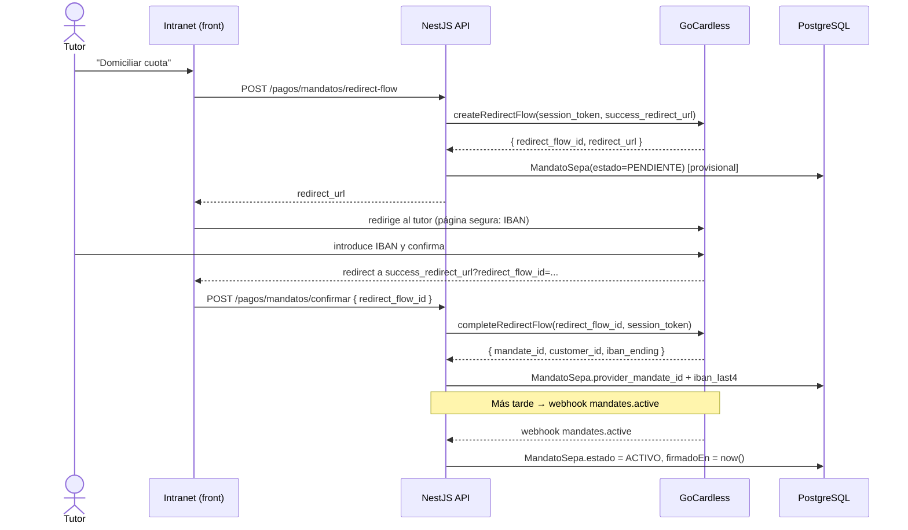
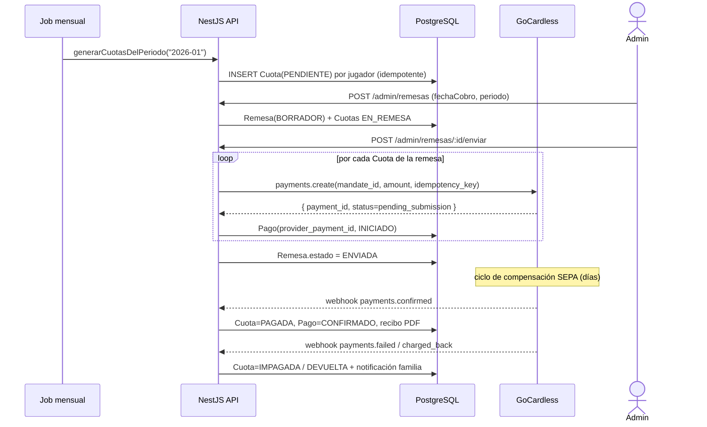
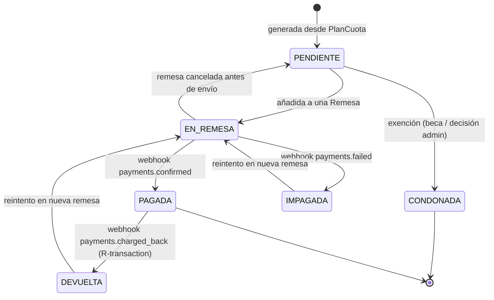
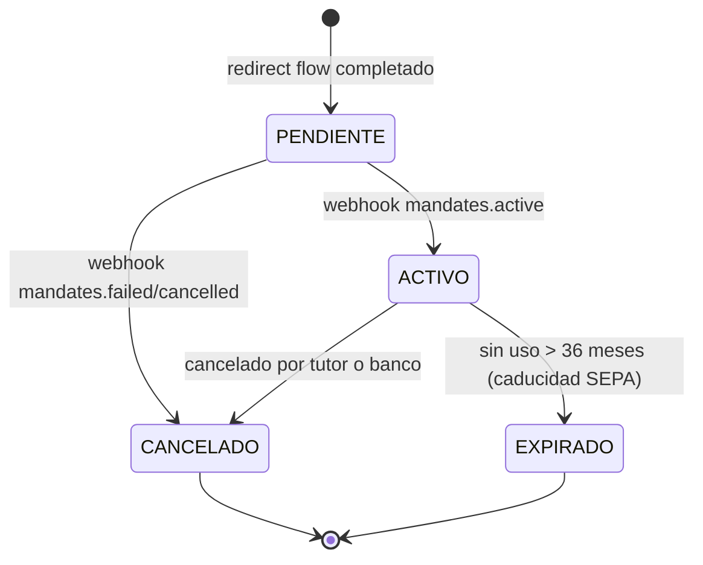

# 04 · Sistema de pagos (Entregable)

> Autor: Especialista en sistemas de pago recurrente.
> Stack: NestJS 11 · PostgreSQL · Prisma. Modelo de datos canónico en [`prisma/schema.prisma`](../prisma/schema.prisma) (ver [`docs/02-modelo-datos.md`](./02-modelo-datos.md)).
> Decisión de arquitectura ya tomada: **GoCardless** para domiciliación SEPA recurrente (cuotas de cantera) y **Stripe** para pagos puntuales con tarjeta (entradas).

---

## 1. Resumen de decisión

El club tiene dos flujos de cobro con naturaleza muy distinta y por eso se usan dos proveedores especializados en lugar de forzar uno solo:

- **Cuotas mensuales de cantera → GoCardless (SEPA Core Direct Debit).** Son cobros recurrentes, predecibles, de bajo importe y a clientes españoles con cuenta bancaria. El cobro por adeudo domiciliado (recibo SEPA) es lo que las familias esperan culturalmente y lo más barato por transacción. GoCardless gestiona el ciclo de vida del **mandato** (autorización del deudor), la generación y el cobro de pagos recurrentes, y notifica el resultado vía webhooks días después (el adeudo SEPA no es inmediato). El club deja de mantener cuadernos bancarios y conciliación manual.

- **Entradas a partidos/eventos → Stripe (Checkout, tarjeta).** Es un pago **puntual** de un comprador que muchas veces no tiene cuenta en el club ni quiere domiciliar nada. Necesita confirmación inmediata (entrega de entrada al instante), soporta tarjeta, Apple/Google Pay y Bizum. Stripe Checkout es una página alojada que mantiene al club fuera del alcance de datos de tarjeta (PCI-DSS SAQ-A).

### Comparativa breve

| Criterio | GoCardless (SEPA DD) | Stripe (tarjeta / Checkout) |
|---|---|---|
| Caso de uso en el club | Cuotas mensuales recurrentes (cantera) | Entradas, pagos puntuales |
| Instrumento | Adeudo domiciliado SEPA Core (recibo) | Tarjeta, wallets, Bizum |
| Recurrencia | Nativa (mandato + subscriptions/payments) | Puntual (un PaymentIntent por compra) |
| Confirmación | Diferida (días: ciclo de compensación SEPA) | Inmediata |
| Coste por transacción | Bajo y plano, ideal para importes pequeños recurrentes | % + fijo por transacción (más caro en importes bajos) |
| Devoluciones | R-transactions SEPA (chargeback hasta 8 semanas / 13 meses si no autorizado) | Disputas/refunds de tarjeta |
| Datos sensibles | IBAN custodiado por el proveedor | PAN nunca toca el backend (Checkout/Elements) |
| Alcance PCI | No aplica (no es tarjeta) | SAQ-A |

**Regla de negocio:** una `Cuota` recurrente se cobra **siempre** por `SEPA_GOCARDLESS`; una `CompraEntrada` se cobra **siempre** por `TARJETA_STRIPE`. `TRANSFERENCIA`/`EFECTIVO` quedan como métodos manuales de respaldo (conciliación administrativa).

---

## 2. Arquitectura de pagos recurrentes

La cuota mensual se modela separando **deuda** de **liquidación**:

- **`PlanCuota`** — plantilla del cobro recurrente de una categoría: `importeCentimos`, `periodicidad` (`MENSUAL`/`TRIMESTRAL`/`ANUAL`/`MATRICULA`), `diaCobro` (día del mes objetivo). No representa dinero, solo la regla.
- **`Cuota`** — la deuda devengada de **un jugador en un periodo** (`periodo` = `"2026-01"`). Tiene unicidad `(jugadorId, periodo, concepto)` para no duplicar el cargo del mes. Lleva el `estado` (`PENDIENTE → EN_REMESA → PAGADA | IMPAGADA | DEVUELTA | CONDONADA`).
- **`MandatoSepa`** — autorización del tutor para domiciliar. Guarda `providerMandateId` (id de GoCardless), `ibanLast4` y `titular`. **Nunca el IBAN completo** (lo custodia GoCardless).
- **`Remesa`** — agrupación de cuotas que se cobran en lote en una `fechaCobro` ("pasar la remesa" mensual del club).
- **`Pago`** — intento/liquidación real con `providerPaymentId` único (id de GoCardless o Stripe), base de la idempotencia de webhooks y de la conciliación.

### Flujo recurrente de extremo a extremo

1. **Alta de mandato.** El tutor inicia un *redirect flow* de GoCardless desde la intranet; introduce su IBAN en la página segura de GoCardless. Al volver, se confirma el flow y se crea/activa el `MandatoSepa` (`PENDIENTE` → `ACTIVO` cuando GoCardless emite el webhook `mandates.active`).
2. **Generación mensual de cuotas.** Un job programado (p. ej. el día 1) recorre los jugadores activos con `PlanCuota` aplicable y crea las `Cuota` del `periodo` en estado `PENDIENTE` (idempotente por la unique key). Se asocia el `mandatoId` del tutor de contacto principal.
3. **Agrupación en remesa.** El administrador crea una `Remesa` (`referencia` `REM-2026-01`, `fechaCobro`), mueve las cuotas elegibles a `EN_REMESA` y las vincula al `remesaId`. Solo entran cuotas con mandato `ACTIVO`.
4. **Cobro.** Al enviar la remesa se crea en GoCardless un *payment* por cada cuota (sobre su mandato), guardando el id devuelto en `Pago.providerPaymentId` (estado `INICIADO`).
5. **Conciliación vía webhooks.** Días después GoCardless envía `payments.confirmed` (→ `Cuota.PAGADA`, `Pago.CONFIRMADO`) o `payments.failed` / `payments.charged_back` (→ `IMPAGADA` / `DEVUELTA`). El estado se actualiza de forma idempotente.

---

## 3. Diagramas de secuencia (Mermaid)

### 3.1 Alta de mandato SEPA (redirect flow)



### 3.2 Cobro mensual de la remesa



---

## 4. Ciclo de vida de estados (Mermaid)

### 4.1 Estado de `Cuota`



### 4.2 Estado de `MandatoSepa`



> Un mandato SEPA caduca si no se usa en **36 meses**; al estar las cuotas en uso mensual no debería ocurrir, pero el estado `EXPIRADO` cubre bajas de jugadores con mandato inactivo.

---

## 5. Webhooks

Toda actualización de estado de pago proviene de webhooks, **nunca** de la respuesta síncrona de creación (SEPA es diferido). Dos endpoints dedicados, cada uno con verificación de firma propia:

- `POST /webhooks/gocardless`
- `POST /webhooks/stripe`

### Eventos clave de GoCardless

| Evento (resource_type.action) | Efecto en el modelo |
|---|---|
| `mandates.active` | `MandatoSepa.estado = ACTIVO`, `firmadoEn = now()` |
| `mandates.cancelled` / `mandates.failed` | `MandatoSepa.estado = CANCELADO` (bloquea nuevas remesas) |
| `mandates.expired` | `MandatoSepa.estado = EXPIRADO` |
| `payments.confirmed` | `Pago.CONFIRMADO`, `Cuota.PAGADA`, genera recibo PDF |
| `payments.failed` | `Pago.FALLIDO`, `Cuota.IMPAGADA`, dispara notificación |
| `payments.charged_back` | `Cuota.DEVUELTA` (R-transaction: devolución del deudor) |
| `payments.paid_out` | Marca conciliación de pago en cuenta (informativo) |

### Eventos clave de Stripe

| Evento | Efecto en el modelo |
|---|---|
| `checkout.session.completed` | `CompraEntrada.CONFIRMADO`, emite entrada/QR |
| `payment_intent.succeeded` | Confirma `Pago`/compra (idempotente con el anterior) |
| `payment_intent.payment_failed` | `CompraEntrada.FALLIDO` |
| `charge.refunded` | `EstadoPago.REEMBOLSADO` |

### Verificación de firma

- **GoCardless:** cabecera `Webhook-Signature` = HMAC-SHA256 del cuerpo **crudo** con el `webhook_secret`. Se compara con `crypto.timingSafeEqual`. Hay que conservar el `rawBody` (configurar `bodyParser` para que NestJS no lo descarte).
- **Stripe:** cabecera `Stripe-Signature`, verificada con `stripe.webhooks.constructEvent(rawBody, sig, endpointSecret)`, que valida firma y tolerancia temporal.

Toda firma inválida responde **400** sin tocar la base de datos.

### Idempotencia

GoCardless envía los eventos en **lotes** y puede reentregarlos; Stripe reintenta ante errores. Reglas:

1. Al crear un pago se envía un `Idempotency-Key` al proveedor para no duplicar cargos.
2. El `providerPaymentId` es **UNIQUE** en `Pago` (y en `CompraEntrada`). Cada webhook resuelve el `Pago` por ese id; si el evento ya fue aplicado (estado destino alcanzado), se ignora (no-op) y se responde **200**.
3. Opcional recomendado: tabla de eventos procesados (`provider_event_id` único) para descartar reentregas exactas antes de tocar lógica de negocio.

Responder siempre **2xx** rápido tras persistir; el trabajo pesado (PDF, email) se delega a una cola.

---

## 6. Gestión de impagos (devoluciones SEPA)

En SEPA las devoluciones se llaman **R-transactions** (Reject, Return, Refund, Reversal, Request for cancellation). Las dos relevantes para el club:

- **Failed (`payments.failed`)**: el adeudo no llega a cobrarse (saldo insuficiente, cuenta cerrada, mandato no válido). La cuota pasa a `IMPAGADA`.
- **Charged back (`payments.charged_back`)**: el deudor o su banco devuelve un adeudo ya cobrado. Plazo de **8 semanas** para devolución autorizada y hasta **13 meses** si el deudor alega que no autorizó. La cuota pasa a `DEVUELTA`.

Flujo de tratamiento:

1. **Marcado automático** vía webhook: `Cuota.IMPAGADA`/`DEVUELTA`, `Pago.FALLIDO`, se registra en `AuditLog`.
2. **Notificación a la familia**: email/push automático con motivo y plazo de regularización (no exponer detalles bancarios).
3. **Reintentos**: la cuota impagada/devuelta se puede reincluir en una **nueva remesa** del mes siguiente (vuelve a `EN_REMESA`). Política sugerida: hasta 2 reintentos; tras ello, escalado manual y posible suspensión deportiva según reglamento del club.
4. **Coste de devolución**: GoCardless puede repercutir una comisión por adeudo devuelto; se contabiliza aparte (no se carga al concepto de la cuota sin aviso).
5. **Condonación**: si procede beca/exención, el administrador marca la cuota `CONDONADA` (no se reintenta).

---

## 7. Remesas SEPA

En España, el modelo tradicional es que el club **"pasa la remesa"** una vez al mes: agrupa todos los recibos domiciliados y los envía al banco para cobro en una fecha. Históricamente esto se hace generando un fichero **Cuaderno 19 / ISO 20022 `pain.008.001.02`** (XML SEPA Direct Debit) y subiéndolo a la banca electrónica.

| Opción | Cómo funciona | Pros | Contras |
|---|---|---|---|
| **GoCardless (elegido)** | El club crea *payments* por API sobre cada mandato; GoCardless genera y presenta los adeudos al sistema bancario, gestiona R-transactions y notifica por webhook. | Sin fichero manual, sin banca electrónica, conciliación automática, gestión de mandatos y devoluciones. | Dependencia del proveedor y su comisión; liquidación según calendario de GoCardless. |
| **Fichero `pain.008` manual** | El backend genera el XML SEPA, el administrador lo sube al banco; la conciliación se hace con el fichero de devoluciones `pain.002`/Cuaderno 19-14. | Coste bancario mínimo, control total. | Hay que custodiar IBAN completos (más alcance RGPD/seguridad), conciliación y devoluciones manuales, gestión del esquema de mandatos propia. |

**Decisión:** GoCardless automatiza el ciclo completo, por eso `MandatoSepa` guarda `providerMandateId` y **no el IBAN**. La generación de `pain.008` queda documentada solo como **alternativa de contingencia** (p. ej. si se migrara a cobro bancario directo); en ese caso la `Remesa` ya tiene la estructura (referencia, fecha de cobro, cuotas vinculadas) para producir el XML.

---

## 8. Recibos PDF

Cada cuota pagada (`payments.confirmed`) genera un **recibo en PDF**:

- **Generación**: en un worker asíncrono (cola) tras el webhook de confirmación. Contenido: datos del club, tutor (titular), jugador, concepto, periodo, importe, fecha de cobro, referencia de remesa y `ibanLast4` (nunca el IBAN completo).
- **Almacenamiento**: en object storage (S3 / Supabase Storage), bucket **privado**. La ruta se guarda en `Pago.reciboUrl` (clave de storage, igual patrón que `Documento.storageKey`).
- **Descarga por la familia**: nunca enlace público. El endpoint genera una **URL firmada y temporal** (expiración corta) previa comprobación de que el usuario `FAMILIA` autenticado es tutor del jugador de esa cuota.
- **Retención**: 6 años (conservación contable en España), alineado con `docs/02-modelo-datos.md`.

---

## 9. Endpoints REST propuestos

Prefijo `/api/v1`. Roles según enum `Rol`. Las rutas de familia exigen además que el recurso pertenezca al tutor autenticado.

| Método | Ruta | Rol | Descripción |
|---|---|---|---|
| `POST` | `/pagos/mandatos/redirect-flow` | FAMILIA | Inicia el redirect flow de GoCardless (registrar IBAN/mandato). Devuelve `redirect_url`. |
| `POST` | `/pagos/mandatos/confirmar` | FAMILIA | Completa el redirect flow tras volver; crea/activa el `MandatoSepa`. |
| `GET` | `/pagos/mandatos` | FAMILIA | Lista los mandatos del tutor (estado, `ibanLast4`, titular). |
| `DELETE` | `/pagos/mandatos/:id` | FAMILIA | Cancela el mandato (propaga cancelación a GoCardless). |
| `GET` | `/pagos/cuotas` | FAMILIA | Lista cuotas del/los jugador(es) del tutor con su estado. |
| `GET` | `/pagos/cuotas/:id/recibo` | FAMILIA | Devuelve URL firmada temporal del recibo PDF. |
| `POST` | `/webhooks/gocardless` | público (firmado) | Recepción de eventos GoCardless. |
| `POST` | `/webhooks/stripe` | público (firmado) | Recepción de eventos Stripe. |
| `POST` | `/admin/cuotas/generar` | ADMIN | Genera las cuotas de un `periodo` desde los `PlanCuota` activos. |
| `POST` | `/admin/remesas` | ADMIN | Crea una remesa (BORRADOR) y agrupa cuotas elegibles. |
| `POST` | `/admin/remesas/:id/enviar` | ADMIN | Envía la remesa: crea los payments en GoCardless. |
| `POST` | `/admin/cuotas/:id/marcar-pago` | ADMIN | Marca pago manual (transferencia/efectivo) y concilia. |
| `GET` | `/admin/impagos` | ADMIN, COORDINADOR | Lista cuotas `IMPAGADA`/`DEVUELTA` con motivo y reintentos. |
| `POST` | `/admin/cuotas/:id/condonar` | ADMIN | Marca la cuota `CONDONADA` (beca/exención). |
| `GET` | `/admin/remesas/:id/export` | ADMIN | Exporta la remesa (CSV/contable; opcional `pain.008` de contingencia). |
| `POST` | `/entradas/:eventoId/checkout` | público/FAMILIA | Crea una Stripe Checkout Session para comprar entradas. |

---

## 10. Seguridad y cumplimiento

- **PCI-DSS — SAQ-A.** El backend **nunca** ve datos de tarjeta: Stripe Checkout (página alojada) recoge el PAN. El club solo cumple el cuestionario reducido **SAQ-A**.
- **IBAN.** No se persiste el IBAN completo en ninguna tabla: `MandatoSepa` guarda `providerMandateId` + `ibanLast4`. El dato bancario lo custodia GoCardless (reduce alcance RGPD y de seguridad).
- **RGPD.** Base de legitimación: ejecución de contrato (cuota) y obligación legal (contable). `Consentimiento` versionado y `AuditLog` para trazabilidad de accesos a datos financieros. Minimización de datos en recibos y notificaciones (no exponer IBAN ni motivos bancarios sensibles). Retención contable 6 años.
- **Claves de API en secret manager.** Tokens de GoCardless/Stripe y `webhook_secret` nunca en el repo ni en `.env` versionado; se inyectan desde un gestor de secretos (AWS Secrets Manager / Vault / variables del orquestador). Distintas claves para sandbox y producción.
- **Webhooks firmados.** Verificación obligatoria de firma (HMAC GoCardless, `Stripe-Signature`) sobre el cuerpo crudo; firma inválida → 400. Idempotencia por `providerPaymentId` único.
- **Transporte y acceso.** HTTPS extremo a extremo, RBAC por `Rol`, URLs firmadas temporales para recibos, rate-limiting en endpoints públicos y de webhook.

---

## 11. Snippet de ejemplo (NestJS / TypeScript)

> Ilustrativo. Asume `@nestjs/common`, cliente oficial `gocardless-nodejs`, Prisma y `rawBody` habilitado (`NestFactory.create(AppModule, { rawBody: true })`).

```typescript
// pagos/mandatos.service.ts
import { Injectable } from '@nestjs/common';
import { ConfigService } from '@nestjs/config';
import * as gocardless from 'gocardless-nodejs';
import { Environments } from 'gocardless-nodejs/constants';
import { PrismaService } from '../prisma/prisma.service';

@Injectable()
export class MandatosService {
  private readonly gc: gocardless.GoCardlessClient;

  constructor(private cfg: ConfigService, private prisma: PrismaService) {
    this.gc = gocardless(
      this.cfg.getOrThrow('GOCARDLESS_TOKEN'),     // desde secret manager
      Environments.Live,
    );
  }

  /** Inicia el redirect flow para que el tutor registre su IBAN/mandato. */
  async crearRedirectFlow(tutorId: string, sessionToken: string) {
    const flow = await this.gc.redirectFlows.create({
      session_token: sessionToken,
      success_redirect_url: `${this.cfg.get('APP_URL')}/pagos/mandato/ok`,
      prefilled_customer: { given_name: undefined }, // se completa en GC
      metadata: { tutorId },
    });
    return { redirectFlowId: flow.id, redirectUrl: flow.redirect_url };
  }

  /** Completa el flow al volver el tutor y persiste el mandato (sin IBAN completo). */
  async confirmar(tutorId: string, redirectFlowId: string, sessionToken: string) {
    const completed = await this.gc.redirectFlows.complete(redirectFlowId, {
      session_token: sessionToken,
    });
    const mandate = await this.gc.mandates.find(completed.links.mandate);

    return this.prisma.mandatoSepa.create({
      data: {
        tutorId,
        providerMandateId: mandate.id,
        ibanLast4: completed.links?.customer_bank_account // últimos 4 vía bank account
          ? (await this.gc.customerBankAccounts
              .find(completed.links.customer_bank_account)).account_number_ending
          : '0000',
        titular: 'Titular cuenta', // tomado del customer de GC
        estado: 'PENDIENTE',        // pasará a ACTIVO con webhook mandates.active
      },
    });
  }
}
```

```typescript
// webhooks/gocardless.controller.ts
import {
  BadRequestException, Body, Controller, Headers, Post, RawBodyRequest, Req,
} from '@nestjs/common';
import { Request } from 'express';
import { createHmac, timingSafeEqual } from 'crypto';
import { ConfigService } from '@nestjs/config';
import { PrismaService } from '../prisma/prisma.service';

@Controller('webhooks/gocardless')
export class GoCardlessWebhookController {
  constructor(private cfg: ConfigService, private prisma: PrismaService) {}

  @Post()
  async handle(
    @Req() req: RawBodyRequest<Request>,
    @Headers('webhook-signature') signature: string,
    @Body() body: { events: any[] },
  ) {
    const raw = req.rawBody!; // cuerpo crudo, imprescindible para la firma
    const expected = createHmac('sha256', this.cfg.getOrThrow('GC_WEBHOOK_SECRET'))
      .update(raw)
      .digest('hex');

    // Verificación de firma en tiempo constante
    const ok =
      signature &&
      expected.length === signature.length &&
      timingSafeEqual(Buffer.from(expected), Buffer.from(signature));
    if (!ok) throw new BadRequestException('Firma inválida');

    for (const ev of body.events) {
      await this.procesarEvento(ev); // idempotente
    }
    return { ok: true }; // 200: GoCardless no reintenta
  }

  private async procesarEvento(ev: any) {
    if (ev.resource_type !== 'payments') return; // mandates.* en otro handler
    const providerPaymentId = ev.links.payment;

    // Idempotencia: localizamos el Pago por su id único de proveedor.
    const pago = await this.prisma.pago.findUnique({
      where: { providerPaymentId },
      include: { cuota: true },
    });
    if (!pago) return; // pago desconocido o reentrega previa al alta: no-op

    if (ev.action === 'confirmed' && pago.estado !== 'CONFIRMADO') {
      await this.prisma.$transaction([
        this.prisma.pago.update({
          where: { id: pago.id },
          data: { estado: 'CONFIRMADO', pagadoEn: new Date() },
        }),
        this.prisma.cuota.update({
          where: { id: pago.cuotaId! },
          data: { estado: 'PAGADA' },
        }),
      ]);
      // encolar generación de recibo PDF (worker)
    }

    if (ev.action === 'failed') {
      await this.actualizar(pago, 'FALLIDO', 'IMPAGADA');
    }
    if (ev.action === 'charged_back') {
      await this.actualizar(pago, 'FALLIDO', 'DEVUELTA');
    }
  }

  private actualizar(pago: any, estadoPago: string, estadoCuota: string) {
    if (pago.estado === estadoPago) return Promise.resolve(); // ya aplicado
    return this.prisma.$transaction([
      this.prisma.pago.update({ where: { id: pago.id }, data: { estado: estadoPago as any } }),
      this.prisma.cuota.update({ where: { id: pago.cuotaId! }, data: { estado: estadoCuota as any } }),
    ]);
  }
}
```
