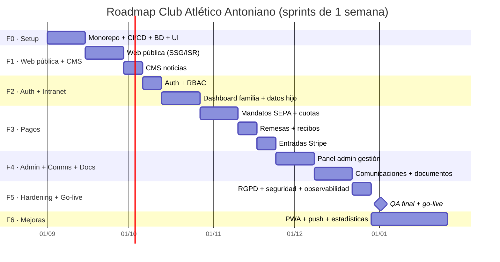

# 07 · Roadmap de desarrollo (Entregable)

> Autor: PM + Arquitecto Full Stack · Revisado por Pagos y Seguridad/RGPD.
> Estimaciones en **sprints de 1 semana**. Equipo pequeño (ver §5). Las fechas asumen *kickoff* en sprint S1.

## 1. Resumen de fases

| Fase | Nombre | Objetivo | Duración | MVP |
|---|---|---|---|---|
| **F0** | Setup y cimientos | Monorepo, CI/CD, BD, *design system*, entorno desplegable vacío | 2 sem | ✅ |
| **F1** | Web pública + CMS noticias | Presencia pública indexable, noticias gestionables | 3 sem | ✅ |
| **F2** | Auth + intranet familias | Login, RBAC, dashboard familia, datos del hijo/a | 3 sem | ✅ |
| **F3** | Pagos SEPA + entradas | Mandatos, cuotas, remesas, recibos (GoCardless) + entradas (Stripe) | 4 sem | ✅ (núcleo) |
| **F4** | Panel admin + comunicaciones + documentos | Gestión completa, mensajería, documentos | 4 sem | ⚠️ parcial |
| **F5** | Hardening RGPD/seguridad + observabilidad + go-live | Auditoría, endurecimiento, monitorización, lanzamiento | 2 sem | ✅ (cierre MVP) |
| **F6** | Mejoras post-lanzamiento | PWA/app, push, estadísticas | 4+ sem | ❌ post-MVP |

**Total hasta go-live (F0–F5): ~18 semanas (≈4,5 meses).**

> 🟢 **MVP (primer release público):** **F0 + F1 + F2 + F3 (núcleo de pagos) + F5**.
> La F4 entra parcialmente (gestión mínima de jugadores/familias/cuotas necesaria para operar); el resto de F4 y toda la F6 son post-lanzamiento. Ver §6.

## 2. Diagrama Gantt (Mermaid)

## 3. Detalle por fase

### Fase 0 — Setup y cimientos (2 sem)
- **Objetivo:** repositorio y *pipeline* listos; cualquier *commit* despliega.
- **Alcance:** monorepo pnpm + Turborepo; `packages/db` (Prisma + esquema inicial usuarios/roles + migraciones); `packages/shared` (zod, enums); `packages/ui` (shadcn/ui + tokens); `docker-compose` local; GitHub Actions (lint/typecheck/test/build/migrate/deploy); entornos staging en Vercel + Railway; Sentry y health check básicos.
- **Entregables:** repo con CI verde, staging accesible (web vacía + API `/health`), `.env.example`, README de arranque.
- **Hito M0:** *“Hello world” desplegado en staging vía CI/CD con migración aplicada.*
- **Aceptación:** PR a `main` despliega a staging automáticamente; `prisma migrate deploy` corre en CD; `pnpm dev` levanta todo en local.

### Fase 1 — Web pública + CMS de noticias (3 sem)
- **Objetivo:** presencia pública profesional, rápida e indexable, con noticias autogestionables.
- **Alcance:** páginas Inicio, Primer equipo, Cantera, Club, Contacto, Entradas (informativa); módulo Noticias (modelo, API CRUD, listado/detalle con ISR); CMS en `/admin/noticias` (alta/edición, imagen a Storage, borrador/publicado); SEO (metadata, OG, sitemap, robots), accesibilidad, *responsive*.
- **Entregables:** web pública navegable en staging; editor de noticias funcional; *on-demand revalidation* al publicar.
- **Hito M1:** *Web pública en línea con primera noticia publicada desde el CMS.*
- **Aceptación:** Lighthouse ≥ 90 (perf/SEO/a11y) en home; publicar una noticia la hace visible (ISR) en < 30 s; formulario de contacto envía email (Resend).

### Fase 2 — Auth + intranet familias (3 sem)
- **Objetivo:** acceso seguro y panel privado para familias con los datos de su hijo/a.
- **Alcance:** login por DNI/email + contraseña (Argon2id), JWT access/refresh en cookies `httpOnly`, recuperación de contraseña; RBAC (`SUPER_ADMIN`/`ADMIN`/`COORDINADOR`/`ENTRENADOR`/`FAMILIA`) con guards; *scoping* de datos (familia solo ve a sus jugadores); dashboard familia (datos del jugador, equipo/categoría, calendario básico); BFF de cookies en Next.js.
- **Entregables:** flujo de autenticación completo; intranet `/intranet` protegida; vista de datos del hijo/a.
- **Hito M2:** *Una familia inicia sesión y ve los datos de su hijo/a.*
- **Aceptación:** sesión persistente con *refresh* rotativo; una familia NO puede ver jugadores ajenos (verificado en test); rate limiting en login; logout invalida refresh.

### Fase 3 — Pagos SEPA + entradas Stripe (4 sem) — *núcleo del MVP*
- **Objetivo:** cobrar cuotas por SEPA recurrente y vender entradas online.
- **Alcance:**
  - **GoCardless:** alta de **mandato SEPA** (flujo de autorización del tutor), modelo de **cuotas** (concepto, importe, periodicidad), generación de **remesas/cobros**, conciliación vía webhooks (`payment_confirmed`/`failed`), **recibos** (PDF + email Resend), gestión básica de impagos.
  - **Stripe:** **venta de entradas** (Checkout/Payment Intent), confirmación por webhook, entrada/justificante por email.
  - Idempotencia en webhooks; auditoría de operaciones de pago.
- **Entregables:** familia firma mandato y ve sus cuotas/recibos; admin lanza una remesa; visitante compra una entrada.
- **Hito M3:** *Primer cobro SEPA confirmado y primera entrada vendida (sandbox).*
- **Aceptación:** mandato creado y verificado por webhook; remesa genera cobros y recibos; webhook reenviado no duplica; compra de entrada genera justificante; estados de pago reflejados en intranet.

### Fase 4 — Panel admin + comunicaciones + documentos (4 sem)
- **Objetivo:** que el club opere por completo sin intervención técnica.
- **Alcance:** CRUD admin de jugadores, equipos, categorías, familias/tutores; gestión de cuotas e impagos avanzada; **comunicaciones** (mensajes/avisos por equipo/categoría/club, email vía Resend, bandeja en intranet); **documentos** (subida a Storage, asignación a familias/jugadores, descarga con permisos); panel de auditoría.
- **Entregables:** admin completo; envío de comunicación segmentada; reparto de documentos.
- **Hito M4:** *El club gestiona altas, cuotas, una comunicación masiva y un documento sin soporte técnico.*
- **Aceptación:** RBAC respetado en cada acción; comunicación segmentada llega solo a destinatarios correctos; documento solo visible para familia autorizada; toda acción sobre PII queda en `audit_log`.

### Fase 5 — Hardening RGPD/seguridad + observabilidad + go-live (2 sem)
- **Objetivo:** endurecer, monitorizar y lanzar a producción con datos reales.
- **Alcance:** revisión RGPD (consentimientos, derechos ARCO, retención, encargados de tratamiento), pentest ligero/OWASP, *security headers*, repaso de CORS/cookies/rate-limits; Sentry + logs pino + uptime + alertas en producción; backups + PITR + ensayo de restauración; ejecución del **checklist go-live** (doc 06 §8); paso de pagos a modo *live*.
- **Entregables:** producción en `cantonioano.es`; monitorización y alertas activas; runbook de incidentes.
- **Hito M5 (Go-live):** *Plataforma en producción con la primera familia real operando.*
- **Aceptación:** checklist de go-live al 100%; alerta de prueba recibida; restauración de backup verificada; cobro/entrada reales de prueba ejecutados y revertidos.

### Fase 6 — Mejoras post-lanzamiento (4+ sem) — *post-MVP*
- **Objetivo:** ampliar valor tras estabilizar.
- **Alcance:** PWA instalable / app móvil; notificaciones push (convocatorias, impagos, avisos); estadísticas y cuadros de mando (asistencia, ingresos, morosidad); posibles integraciones (calendario federativo, exportaciones contables).
- **Entregables:** según priorización con el cliente.
- **Hito M6:** *PWA instalable con notificaciones push en producción.*
- **Aceptación:** definida por *backlog* priorizado en su momento.

## 4. Resumen de hitos

| Hito | Fase | Criterio resumido |
|---|---|---|
| M0 | F0 | CI/CD desplegando staging con migración aplicada |
| M1 | F1 | Web pública en línea + noticia publicada desde CMS |
| M2 | F2 | Familia con login viendo datos de su hijo/a (con *scoping*) |
| M3 | F3 | Cobro SEPA confirmado + entrada vendida (sandbox) |
| M4 | F4 | Club operando altas, cuotas, comunicaciones y documentos |
| **M5** | **F5** | **Go-live en producción con datos reales** |
| M6 | F6 | PWA + push en producción |

## 5. Equipo y estimación de esfuerzo

| Rol | Dedicación | Responsabilidad principal |
|---|---|---|
| Arquitecto / Full Stack senior | 100% | Arquitectura, API NestJS, pagos, revisión de PRs |
| Full Stack mid | 100% | Web/intranet Next.js, CMS, integración API |
| Frontend / UI (parcial) | ~50% | Design system, web pública, accesibilidad |
| PM / QA (parcial) | ~30% | Roadmap, aceptación, QA, relación con el cliente |
| DevOps / Seguridad (puntual) | ~10% | CI/CD, observabilidad, hardening RGPD (picos en F0 y F5) |

- **Esfuerzo F0–F5:** ≈ 18 semanas de calendario. Con ~2,3 FTE efectivos ⇒ **≈ 40–45 semanas-persona**.
- **Cadencia:** sprints semanales, *demo* al cliente al cierre de cada fase, *retro* quincenal.
- **Capacidad de buffer:** ~15% del tiempo reservado para imprevistos e *integración de pagos* (la F3 concentra el mayor riesgo).

## 6. MVP — primer release

**Entra en el MVP (go-live, F0–F5):**
- Web pública + noticias (F1).
- Login + RBAC + dashboard familia con datos del hijo/a (F2).
- **Pagos núcleo (F3):** mandato SEPA, cuotas, remesas, recibos y venta de entradas Stripe.
- **Gestión admin mínima (subconjunto de F4):** CRUD de jugadores/equipos/familias y gestión de cuotas/impagos imprescindible para operar.
- Hardening RGPD/seguridad + observabilidad + go-live (F5).

**Fuera del MVP (posterior):**
- Comunicaciones masivas avanzadas y módulo de documentos completo (resto de F4).
- PWA/app móvil, notificaciones push, estadísticas (F6).

> Criterio de “release” del MVP: una familia real puede registrarse, ver a su hijo/a, firmar el mandato SEPA y pagar la cuota; el club puede dar de alta jugadores y lanzar la remesa; un visitante puede comprar una entrada. Todo bajo RGPD y monitorizado.

## 7. Riesgos y mitigaciones

| # | Riesgo | Prob. | Impacto | Mitigación |
|---|---|---|---|---|
| R1 | Complejidad de integración GoCardless (mandatos, remesas, conciliación) | Alta | Alto | Empezar en *sandbox* en F0/F1 como *spike*; aislar en módulo `pagos/gocardless`; idempotencia y tests de webhook; buffer en F3 |
| R2 | Manejo de datos de **menores** (RGPD) | Media | Alto | RBAC + *scoping* desde F2; auditoría; consentimientos; revisión legal en F5; nunca PII real en staging |
| R3 | Verificación de webhooks de pago / duplicados | Media | Alto | Verificación de firma obligatoria; tabla `webhook_events` idempotente; reintentos y alertas |
| R4 | Equipo pequeño / *bus factor* | Media | Medio | Documentación viva (`docs/`), PRs revisados, *pair* en módulos críticos, no silos de conocimiento |
| R5 | Desviación de alcance (*scope creep*) por peticiones del club | Alta | Medio | MVP fijado por contrato; cambios al *backlog* post-MVP; demos por fase para alinear expectativas |
| R6 | Entregabilidad de email (Resend / SPF-DKIM-DMARC) | Media | Medio | Verificar dominio en F1; monitorizar *bounces*; remitente dedicado |
| R7 | Coste de hosting al crecer (Vercel/Railway) | Baja | Medio | Monitorizar consumo; Dockerfiles listos para migrar a Hetzner+Coolify (doc 06 §2.2) |
| R8 | Migraciones de BD destructivas en producción | Baja | Alto | Patrón expand/contract; `migrate deploy` en CD; PITR + ensayo de restauración trimestral |
| R9 | Disponibilidad/feedback tardío del cliente para QA por fase | Media | Medio | Calendario de demos cerrado por adelantado; criterios de aceptación firmados al inicio de cada fase |
